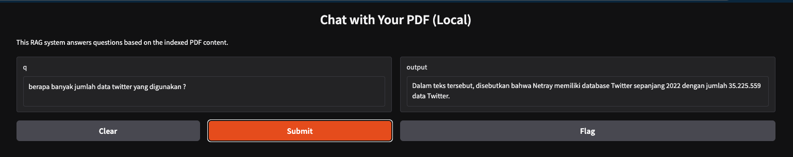

# RAG Demo — Chat with your PDF (Local)

## Demo


> _above demo using [this pdf](./demo/_Meneropong-Tahun-Politik-2024-compressed.pdf)_

A minimal Retrieval-Augmented Generation (RAG) demo that lets you chat with the contents of a PDF locally. It uses:

- Embeddings: `sentence-transformers/all-MiniLM-L6-v2`
- Vector store: FAISS (saved under `faiss_index/`)
- UI: Gradio
- Local LLM options:
  - LM Studio (OpenAI-compatible API on `http://127.0.0.1:1234/v1`)
  - Ollama (e.g., `mistral` model on `http://127.0.0.1:11434`)

## What’s inside

- `ingest.py` — Indexes a PDF into a FAISS vector DB.
- `app.py` — Loads the FAISS index and serves a Gradio chat UI powered by a local LLM.
- `datasets/` — Place your PDFs here (optional).
- `faiss_index/` — Persisted FAISS index (created by `ingest.py`).
- `requirements.in` / `requirements.txt` — Python dependencies.

## Prerequisites

- Python 3.10+ recommended
- macOS (tested) — Linux/Windows should also work with compatible wheels
- One local LLM runtime:
  - LM Studio (start the local server, OpenAI-compatible)
  - OR Ollama (installed and a model pulled, e.g., `ollama pull mistral`)

## Setup with uv

```bash
# 0) Install uv (one-time)
curl -LsSf https://astral.sh/uv/install.sh | sh

# 1) Create a virtualenv with uv
uv venv .venv
source .venv/bin/activate

# 2) Install dependencies via uv
uv pip install -r requirements.txt
```

## Ingest a PDF

Provide a path to the PDF you want to chat with. You can keep PDFs in `datasets/` or use any path.

```bash
# Example: index a PDF into ./faiss_index
uv run python ingest.py --pdf datasets/your.pdf --index-path faiss_index
```

This will create a FAISS index under `faiss_index/`.

## Run the app

By default, `app.py` is configured for LM Studio’s OpenAI-compatible server on `http://127.0.0.1:1234/v1` and doesn’t require an API key.

```bash
uv run python app.py --index-path faiss_index
```

Gradio will print a local URL (e.g., `http://127.0.0.1:7860`) — open it in your browser and ask questions about your PDF.

### Using Ollama instead of LM Studio

Edit `app.py` to switch the LLM client:

- Comment out the `ChatOpenAI` (LM Studio) block
- Uncomment the `Ollama` client and set your model name (e.g., `mistral`)

```python
# from langchain_community.chat_models import ChatOpenAI
from langchain_community.llms import Ollama

# llm = ChatOpenAI(openai_api_base="http://127.0.0.1:1234/v1", openai_api_key="not-needed")
llm = Ollama(base_url="http://127.0.0.1:11434", model="mistral")
```

Restart the app after the change.

## How it works (quick flow)

1) `ingest.py` loads the PDF → splits it into chunks → creates embeddings → saves them to FAISS.
2) `app.py` loads FAISS → builds a `RetrievalQA` chain → answers queries using retrieved chunks + the local LLM.

## Troubleshooting

- “ERROR: Vector database not found … Jalankan ingest.py terlebih dahulu.”
  - Run the ingest step first: `python ingest.py --pdf <path-to.pdf> --index-path faiss_index`
- FAISS install issues on Apple Silicon
  - Ensure you’re on a supported Python version; try a clean venv and `pip install -r requirements.txt` again.
- No LLM responses
  - Confirm LM Studio server is running at `http://127.0.0.1:1234/v1` (or Ollama at `http://127.0.0.1:11434`) and the chosen model is loaded.

## Manage dependencies with uv

- To update the lock file from `requirements.in`:

```bash
uv pip compile requirements.in -o requirements.txt
```

- Then reinstall:

```bash
uv pip install -r requirements.txt
```

## Notes

- `allow_dangerous_deserialization=True` is enabled when loading FAISS; this is necessary for local disk loading of saved indexes.
- Chainlit files (`chainlit.md`, `chainlit.toml`) are present but unused in this Gradio-based demo.
